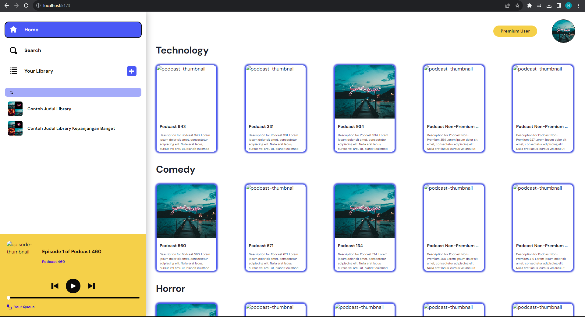
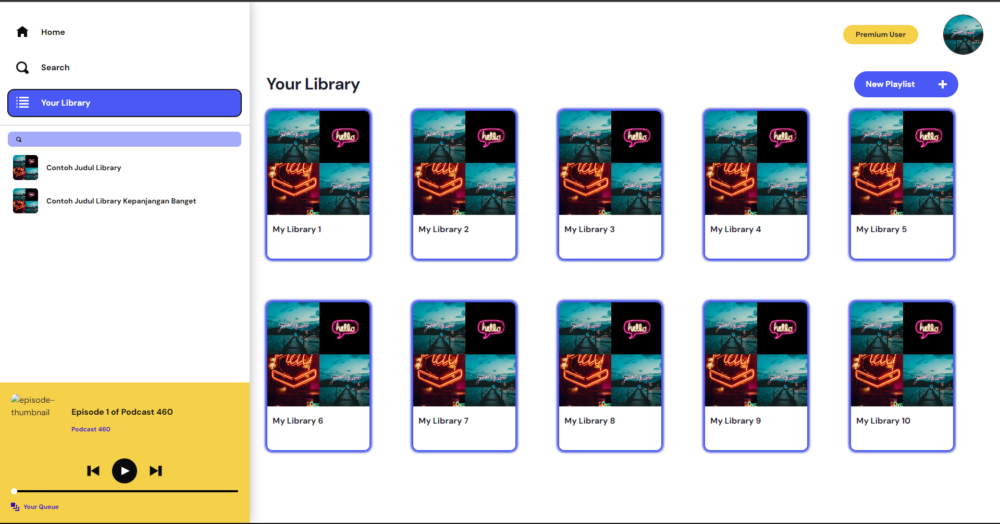
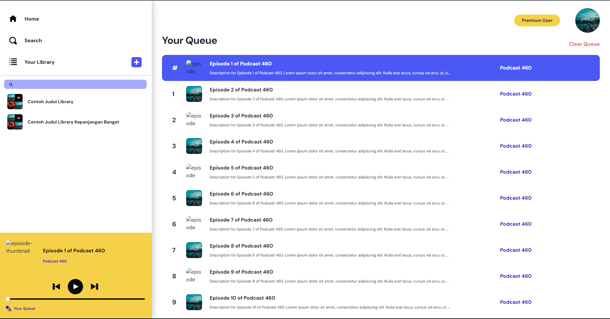
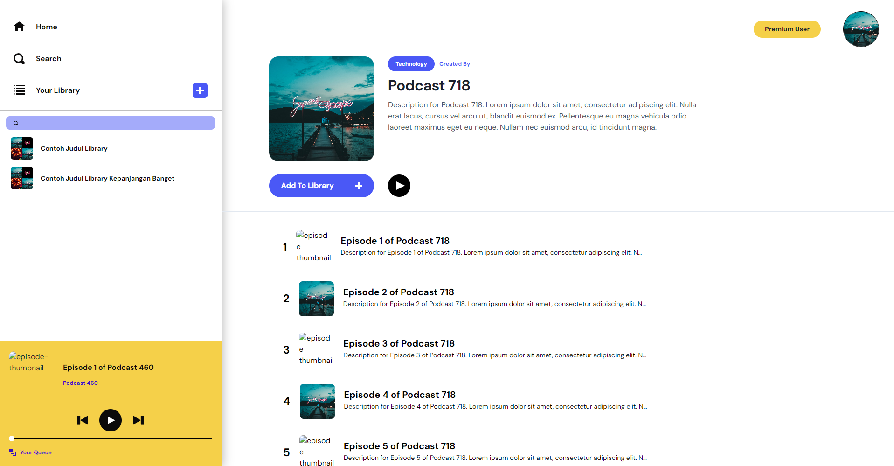

# Premium Podcast App

## Deskripsi Singkat Aplikasi
Aplikasi Premium Podcast App adalah versi premium dari aplikasi php yang telah dibuat sebelumnya. Pada versi premium, pengguna memiliki keleluasaan yang lebih melalui fitur yang ditawarkan, misalnya seperti queue dimana pengguna dapat mengantrikan podcast yang ingin diputarnya dan akan berjalan secara otomatis nantinya. Aplikasi ini dibangun menggunakan Vite + React + Typescript 

## Tampilan Layar

### Halaman Home

### Halaman Search

### Halaman Library

### Halaman Queue

### Halaman Podcast

### Halaman Episode

## Pembagian Tugas
Halaman Home      : 13521149  
Halaman Search    : 13521119  
Halaman Library   : 13521079  
Halaman Queue     : 13521149  
Halaman Podcast   : 13521079  
Halaman Episode   : 13521079  
Halaman Profile   : 13521119  